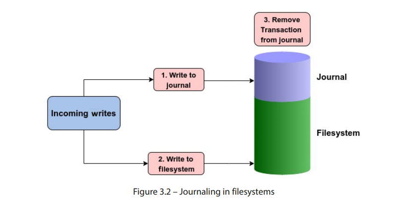
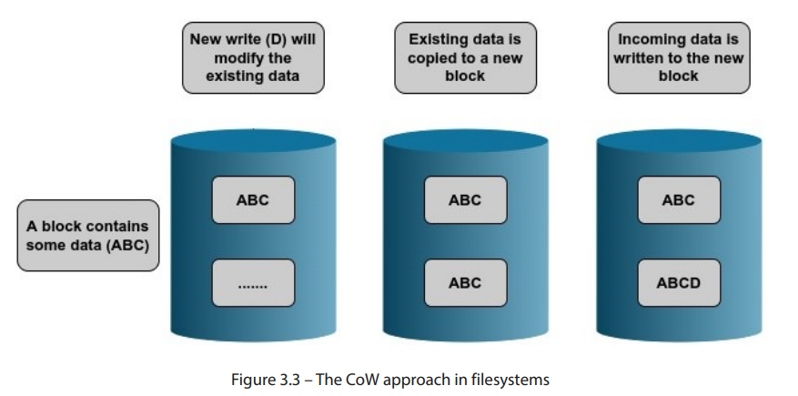
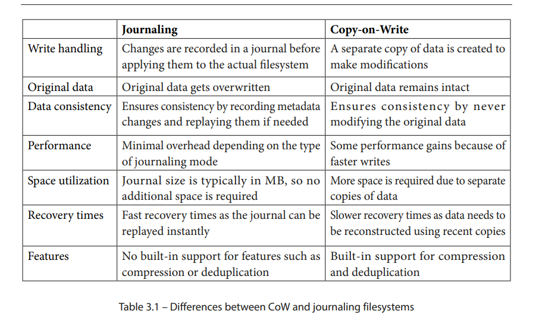

# 对实际文件系统的探索

> 不是所有的根都被埋在地下，有些也在树梢上  jinvirle

内核的io栈被拆解成 虚拟文件系统，块层，物理层三个主要章节。 linux支持的不同风格的文件系统可以看作是vfs的末端。前两个章节让我们对vfs的角色定位，vfs的主要结构，以及它如何通过通用的文件模型帮助用户程序与不同的文件系统进行交互。这意味着我们终于可以在上下文中普遍的使用文件系统一词了。

在 第二章 中，我们定义并解释了 VFS 使用的一些重要数据结构，这些数据结构为不同的文件系统定义了一个通用框架。为了使某个特定的文件系统能够被内核支持，它应该在这个框架定义的边界内运行。但是，并非所有由 VFS 定义的方法都必须被文件系统使用。文件系统应遵循 VFS 中定义的结构并在此基础上进行扩展，以确保它们之间的通用性，但由于每个文件系统在组织数据方面的方式不同，这些结构中可能会有许多方法和字段对于某个特定文件系统并不适用。在这种情况下，文件系统根据其设计定义相关字段，省略不必要的信息。

如我们所见，VFS 位于用户空间程序与实际文件系统之间，并实现了一个通用文件模型，以便应用程序可以使用统一的访问方法来执行操作，而不管底层使用的是哪种文件系统。现在，我们将重点关注这个三明治的一个方面，即包含用户数据的文件系统。

本章将向你介绍 更通用和更受欢迎的linux文件系统，我们将详细讨论extfs文件系统的工作原理，因为它是最常用的。我们还将介绍一些网络文件系统，并探讨与文件系统相关的一些重要概念，如日志记录、用户空间中的文件系统和写时复制（CoW）机制。

我们将覆盖以下主要主题：

- 日志记录的概念

- CoW 机制

- 扩展文件系统家族

- 网络文件系统

- 用户空间中的文件系统

### 技术要求

这个章节完全聚焦于文件系统和相关的概念上，如果你有linux的管理使用经验，但没有深入的理解文件系统，那么本章将成为一个宝贵的练习。了解文件系统概念的前置知识将有助于你更好地理解本章所涉及的内容。本章中展示的命令和示例与发行版无关，可以在任何 Linux 操作系统上运行，如 Debian、Ubuntu、Red Hat、Fedora 等等。文中有一些关于内核源代码的参考。如果你想下载内核源代码，可以从www.kernel.org下载。本书中提到的代码片段来自内核 5.19.9。

## 文件系统的组成概念

正如之前所说，使用Linux的一个主要优点是其支持的文件系统种类繁多。内核对一部分文件系统提供了开箱即用的支持，如xfs，btrfs，ext2,3,4. 这些被称为本地文件系统，这些在设计时就考虑了linux的设计和哲学。与之相反的另外一种  像时nfs和fat，他们被称为非本地系统。这是因为虽然Linux内核能够识别这些文件系统，但支持它们通常需要额外的配置，因为它们不符合原生文件系统所采用的惯例。我们现在还是聚焦本地文件系统，并解释相关的概念。

尽管每个文件系统都声称自己比其他的更快 更好，更可靠也更安全。但也也要意识到没有文件系统适合所有种类的应用。 每个文件系统都有些优势和限制。 从功能的角度看 文件系统有如下分类：

图 3.1 展示了一些支持的文件系统及其各自的类别。由于 Linux 支持大量的文件系统，覆盖所有文件系统将占用我们太多空间（这是一个文件系统的双关语！）。尽管实现细节有所不同，但文件系统通常会利用一些常见的技术来进行内部操作。一些核心概念，如日志记录，在文件系统中更为常见。类似地，一些文件系统使用了流行的 CoW 技术，因此它们不需要日志记录。

下面让我们解释文件系统的日志复制。

## 文件系统的 日志- 日志记录的概念 

文件系统使用一个复杂的结构来在物理磁盘上组织数据。在系统崩溃或突然故障的情况下，文件系统无法以优雅的方式完成其操作，这可能导致其组织结构受损。下次系统启动时，用户需要对文件系统运行某种一致性或完整性检查，以检测并修复这些损坏的结构。

在第二章节中，我们讨论过，Linux 遵循的一个基本原则是将元数据与实际数据分离开。文件的元数据被定义在叫做indoe的独立结构体中。我们还看到目录是如何被当作特殊文件来处理的，它包含文件名到其inode编号的映射。记住这一点，假设我们正在创建一个简单的文件，向其中添加一些文本。为了完成这个操作，内核需要执行以下操作：

- 给这个新文件创建并初始化一个新的inode，资格inode在文件系统里时唯一的。
- 更新这个文件目录的时间戳。
- 更新目录的inode。这是为了确保文件名到inode的映射得到更新。

即使是像文本文件创建这样简单的操作，内核也需要执行多个 I/O 操作以更新多个结构。假设在执行这些操作时，由于硬件或电力故障导致系统突然关闭。此时，创建新文件所需的所有操作都没有成功完成，这将导致文件系统结构不完整。如果文件的 inode 已初始化但未链接到包含该文件的目录，则该 inode 将被视为孤立的。一旦系统重新上线，文件系统将进行一致性检查，删除任何未链接到任何目录的 inode。系统崩溃后，文件系统本身可能保持完整，但个别文件可能会受到影响。在最坏的情况下，文件系统本身也可能会永久损坏。

为了在发生断电和系统崩溃时提高文件系统的可靠性，文件系统中引入了日志记录功能。第一个支持这一功能的文件系统是IBM的JFS（也称为日志文件系统）。在过去的几年中，日志记录已成为文件系统设计中的一个关键组成部分。

文件系统日志功能的概念起源于数据库系统的设计。在大多数数据库中，日志记录保证了数据的一致性和完整性，以防事务因外部事件（如硬件故障）而失败。数据库日志会通过记录操作来跟踪未提交的更改。当系统重新上线时，数据库将使用日志进行恢复。文件系统的日志功能也遵循相同的方式。

任何需要在文件系统上执行的更改，首先会顺序地写入日志。这些更改或修改被称为事务。一旦事务被写入日志，它会被写入磁盘上的相应位置。如果发生系统崩溃，文件系统会回放日志，查看是否有任何事务未完成。当事务已写入磁盘上的位置后，它就会从日志中删除。

根据日志记录的方式，首先会将元数据或实际数据（或两者）写入日志。一旦数据被写入文件系统，事务就会从日志中删除：

需要注意的是，默认情况下，文件系统日志也存储在同一文件系统中，尽管它被存储在一个隔离的区域。有些文件系统还允许将日志存储在独立的磁盘上。日志的大小通常只有几兆字节。

## 一个令人关注的问题——日志是否会对性能产生负面影响？

日志记录的整个意义在于提高文件系统的可靠性，并在系统崩溃和硬件故障的情况下保护其结构。在启用日志记录的文件系统中，数据首先写入日志，然后再写入其指定的磁盘位置。显而易见，我们在到达目的地时增加了额外的步骤，因为我们需要将相同的数据写两次。这肯定会适得其反，破坏文件系统的性能吧？

这是一个看似答案显而易见，但实际上并非如此的问题。使用日志记录并不一定会导致文件系统性能下降。事实上，在大多数情况下，情况恰恰相反。某些工作负载下，两者之间的差异可能微不足道，但在大多数场景中，尤其是在元数据密集型的工作负载下，文件系统日志记录实际上可以提高性能。性能提升的程度可能有所不同。

考虑一个没有日志记录的文件系统。每次修改文件时，采取的自然行动是直接在磁盘上执行相关的修改。对于元数据密集型操作，这可能会对性能产生负面影响。例如，文件内容的修改还需要相应地更新文件的时间戳。这意味着每次处理和修改文件时，文件系统不仅需要更新实际的文件数据，还需要更新元数据。启用日志记录后，对物理磁盘的查找次数较少，因为数据仅在事务已提交到日志或日志已满时才会写入磁盘。另一个好处是日志中使用了顺序写入。在使用日志时，随机写操作会转化为顺序写操作。

在大多数情况下，性能的提升是通过取消元数据操作来实现的。当需要快速更新元数据时，比如递归地对目录及其内容进行操作，使用日志记录可以通过减少频繁的磁盘访问并在原子操作中执行多个更新来提高性能。

当然，文件系统如何实现日志记录在其中也起着重要作用。不同的文件系统在日志记录方面提供了不同的处理方式。例如，一些文件系统只记录文件的元数据，而另一些则在日志中同时记录元数据和实际数据。一些文件系统还提供灵活的处理方式，允许最终用户自行决定日志记录模式。

总结来说，日志记录是现代文件系统的重要组成部分，因为它确保即使在系统崩溃的情况下，文件系统仍然保持结构的完整性。

--  文件系统的cow的神奇之处：

CoW 是一种在 Linux 内核中使用的资源管理机制。这个概念通常与fork系统调用相关。fork从被调用进程复制一个新的进程。当一个新的进程被创建时，内存页被父进程和子进程共享。那么只要页被共享了 那么他们就不能被修改。当父进程或者子进程被修改内存页面时，内核会复制一份并标记为可写。

在 Linux 中，长期存在的大多数文件系统在核心设计原则上采用了非常传统的方法。在过去的几年里，扩展文件系统的两个主要变化是使用日志记录和扩展（extents）。尽管已经采取了一些措施来扩展文件系统以适应现代应用，但一些关键领域如错误检测、快照和去重等却被忽略了。这些功能是当今企业存储环境中的需求。

使用 CoW（写时复制）方法的文件系统与其他文件系统有一个显著的不同。当在 Ext4 或 XFS 文件系统上覆盖数据时，新数据会写到现有数据上方。这意味着原始数据会被销毁。而使用 CoW 方法的文件系统则将旧数据复制到磁盘的其他位置，新的数据会写入这个新位置。因此，才有了写时复制这一术语。由于旧数据或其快照仍然存在，文件系统上的空间利用率会比用户预期的要高得多。这常常让新手用户感到困惑，可能需要一段时间才能适应。一些 Linux 用户对此有一种相当幽默的看法：写时复制吃掉了我的数据。如图 3.3所示，使用 CoW 方法的文件系统会将新数据写入新的块：

作为类比，我们可以将其与电影中的时间旅行概念进行粗略比较。当有人回到过去并对过去做出更改时，会创建一条平行时间线。这会产生与原始时间线不同的副本。CoW 文件系统的操作方式类似。当请求修改文件时，系统不会直接修改原始数据，而是创建数据的一个单独副本。原始数据保持不变，而修改后的版本则存储在另一个位置。

由于在此过程中保留了原始数据，这为我们开辟了一些有趣的方向。正因如此，在系统崩溃的情况下，文件系统恢复变得更加简化。数据的先前状态被保存在磁盘上的另一个位置。因此，如果发生故障，文件系统可以轻松恢复到先前的状态。这使得维护任何日志文件的需求变得多余。它还允许在文件系统级别实现快照。只有被修改的数据块才会被复制到新位置。当需要通过特定的快照恢复文件系统时，数据可以轻松地重建。

表 3.1 突出了日志文件系统和基于 CoW 文件系统之间的一些主要区别。请注意，这些功能的实现和可用性可能会根据文件系统类型的不同而有所变化：

使用基于 CoW（写时复制）方法来组织数据的文件系统包括Zettabyte 文件系统（ZFS）、B 树文件系统（Btrfs）和 Bcachefs。ZFS 最初在 Solaris 上使用，并因其强大的功能迅速获得了广泛的应用。尽管由于许可问题未能纳入内核，但它已经通过ZFS on Linux项目移植到了 Linux 上。Bcachefs 文件系统是从内核的块缓存代码开发而来的，并且正迅速获得流行。它可能会成为未来内核发布的一部分。Btrfs，也被亲切地称为 ButterFS，直接受 ZFS 启发。不幸的是，由于早期版本中的一些 bug，它在 Linux 社区的采用进程放缓。然而，它一直在积极开发，并且已经成为 Linux 内核的一部分超过十年。

尽管存在一些问题，Btrfs 仍然是内核中最先进的文件系统，因其丰富的功能集。如前所述，Btrfs 受到了 ZFS 的深刻影响，并力图提供几乎相同的功能。像 ZFS 一样，Btrfs 不仅仅是一个简单的磁盘文件系统，它还提供了逻辑卷管理器和软件独立磁盘冗余阵列（RAID）的功能。它的一些功能包括快照、校验和、加密、去重和压缩，这些功能通常在常规块文件系统中无法使用。所有这些特点极大简化了存储管理。

总结来说，像 Btrfs 和 ZFS 这样的文件系统的 CoW 方法确保现有数据永远不会被覆盖。因此，即使在系统突然崩溃的情况下，现有数据也不会处于不一致的状态。